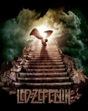

## Projeto de Estudo das 500 Mais da KISS FM


Kiss FM é uma emissora de rádio brasileira de São Paulo, capital do estado homônimo. Opera no dial FM, na frequência 92.5 MHz, e pertence à Rede Mundial de Comunicações, sendo a geradora da rede de rádios com emissoras em Santos e Rio de Janeiro. Seus estúdios estão localizados no Edifício The Central Park, no Espigão da Paulista, onde funcionam os demais veículos da Rede Mundial, onde também fica o transmissor.

Desde sua inauguração, em 2000, em Dezembro a rádio transmite o programa as 500 mais da KISS FM que uma lista das 500 músicas mais votas pelos ouvintes.

O programa não tem segredo – quem quiser, entra no site da emissora e vota em sua música predileta. As 500 músicas mais votadas são transmitidas no final do ano, de maneira interrupta. Por ser uma rádio, só vai votar quem ouve a rádio e, consequentemente, não podemos dizer que essa lista é um retrato do que o “público roqueiro” ou “público metaleiro” (principalmente esse segundo) ouve no geral. Com certeza, muita gente que votou são pessoas que ouvem rock não da mesma maneira que nós aqui do blog ouvimos, mas acho importante no começo de 2021 termos uma ideia de como o gênero e as bandas que carregam a bandeira são vistas (e ouvidas) pelo público brasileiro que se dispõe em participar dessa votação.

### Objetivo do estudo

- Levantar as bandas melhores rankeadas
- Levantar as músicas melhores rankeadas
- Agrupar os resultados por país de origem da banda
- Identificar quais músicas estiverem presentens em quais anos


### Fonte dos dados

Os dados foram baixados no site https://leitespc.blogspot.com/ e cedidos pelo Eduardo F.Souza

No site da rádio não existe um local para baixar os dados da fonte oficial. 
Entrei em contato com a rádio via e-mail e WhatsApp e até hoje (05/12/23) sem resposta.

### Configure seu ambiente

- crie um virtualenv e ative-o
- instale as dependências `pip install -r requirements.txt`
- execute o `jupyter lab` no terminal

### Tratamento dos arquivos

Os scripts estão no ```file_threat.ipynb```

O arquivo de 2000 e 2006 estão com a lista das música é uma linha única.

Para usar no estudo, foi preciso criar um script para tratar esse dado e transformar esse única linha em múltiplas linhas

Exceto o arquivo 2000_orig.txt, os demais estão nesse formato
```
<ordem>. <Banda/Artista> - <Mùsica>
```

Arquivos de 2001 a 2005.

O que o algoritmo precisa fazer é localizar o vamor númerico da ordem antes do ponto, fazer um split até o próximo valor númerico e inserir uma quebra de linha ```\n```


Arquivo de 2006 não tem o ponto depois do número da ordem.


#### Resultado dos tratamento

As bases de 2000 a 2006 foi muito difícil encontrar um padrão e tratá-las de forma adequada.

Algumas linhas de posição estão com valor (??), o que significa que não se tem a informação de qual artista/música estava naquela posição.

Existem duplicidade de nome de música ou artista. Para padronizar esses casos foi criado um script no arquivo

Exemplo:

| Nome 1 | Nome2 |
| ------ | ------- |
| HELP! | HELP |
| HEY, JUDE | HEY, JUDE | 


- foram feitas substituições de caracteres

| De | Para |
| ------ | ------- |
| ```–``` | ```-``` |

Os arquivos tratados serão salvos delimitados por "|"(pipe) e com o padrão de nome <ano>.txt na pasta tratada.

O meu muito obrigado ao Eduardo F.Souza que me enviou um arquivo (planilha) do seu acervo pessoal com a lista das músicas desde 2000. Conforme fui identificando os dados do https://leitespc.blogspot.com com falhas nos dados, substituí pelos dados da planilha.

Para trabalhar com os dados da planilha, copie os dados para uma nova sheet e coloquei no formato/ordem das colunas: posição - artista - música  

### Configurar as chaves para uso nas API's


## Resultado da Análise

**TOP 10 artistas que mais aparecem nas listas**

Quantas vezes o artista apareceu nas listas

| Artista | Total |
| ------ |-------|
| BEATLES         | 398   |
| LED ZEPPELIN    | 291   |
| QUEEN           | 281   |
| AEROSMITH       | 224   |
| PINK FLOYD      | 207   |
| RUSH            | 199   |
| AC/DC           | 197   |
| KISS            | 183   |
| VAN HALEN       | 183   |
| DEEP PURPLE     | 180   |

**Top 10 músicas + artistas que aparecem na lista**

Quantas vezes o artista + música apareceu nas listas

| Artista                            | Música                | Total |
|------------------------------------|-----------------------| ------- |
| LED ZEPPELIN	| STAIRWAY TO HEAVEN	23 | 
| LED ZEPPELIN	| BLACK DOG	            | 23                  |
| RUSH	| TOM SAWYER	           | 23                  |
| DIRE STRAITS	| MONEY FOR NOTHING	    | 23                  |
| DEEP PURPLE	| SMOKE ON THE WATER	   | 23                |
| JETHRO TULL	| AQUALUNG	             | 22                |
| PINK FLOYD	| TIME	                 | 22                |
| STEPPENWOLF | 	BORN TO BE WILD	     | 22        |
| GENESIS	                           | MAMA	                 | 22        |
| BLACK SABBATH	                     | PARANOID	             | 22     |

**Músicas que apareceram em todas as listas**

De todas as músicas das listas, apenas 5 seguem firmes e fortes aparecendo em todas elas.

| Artista | Música | Total |
| ------ | ------- | ------- |
| LED ZEPPELIN	|STAIRWAY TO HEAVEN	23| 
| LED ZEPPELIN	| BLACK DOG	          | 23                  |
| RUSH	| TOM SAWYER	         | 23                  |
| DIRE STRAITS	| MONEY FOR NOTHING	  | 23                  |
| DEEP PURPLE	| SMOKE ON THE WATER	 | 23                |

## Rank das músicas de todas as listas ( Gold Medal )

Encontrar as músicas que melhores rankearam nas listas

Critério:

score = 500 - posição.

Exemplo:

  posição 1 será score = 500 - 1 = 499
  posição 500 será score = 500 - 500 = 0

O rank da música será a soma dos scores de cada lista.

Qual são as músicas top 10 do Gold Medal ?

| Banda | Música                        | Rank   |
| ------ |-------------------------------|--------|
|LED ZEPPELIN   | STAIRWAY TO HEAVEN  | 11.460 |
|DEEP PURPLE    | SMOKE ON THE WATER  | 11.229 |
|BEATLES        | HELP                | 10.569 |
|RUSH           | TOM SAWYER          | 10.535 |
|QUEEN          | BOHEMIAN RHAPSODY   | 10.443 |
|AC/DC          | BACK IN BLACK       | 10.261 |
|LED ZEPPELIN   | KASHMIR             | 10.042 |
|BLACK SABBATH  | PARANOID            | 9.599  |
|STEPPENWOLF    | BORN TO BE WILD     | 9.410  |
|JETHRO TULL    | AQUALUNG            | 9.376  |


Qual são as bandas top 10 do Gold Medal ?

| Banda                   | Rank    |
|-------------------------|---------|
| BEATLES          | 117.102 |
| LED ZEPPELIN     | 99.414  |
| QUEEN            | 88.039  |
| PINK FLOYD       | 73.595  |
| AC/DC            | 71.332  |
| DEEP PURPLE      | 61.047  |
| BLACK SABBATH    | 59.875  |
| RUSH             | 57.436  |
| AEROSMITH        | 55.429  |
| KISS             | 50.741  |


## Música Top das Tops 

**STAIRWAY TO HEAVEN**



Apareceu em todas as listas e lidera o rank Gold Medal.

"é uma canção da banda britânica de rock Led Zeppelin, composta pelo guitarrista Jimmy Page e pelo vocalista Robert Plant para o quarto álbum de estúdio da banda, Led Zeppelin IV, de 1971. Muitas vezes, é considerada uma das maiores canções de rock de todos os tempos" [Wikpedia](https://pt.wikipedia.org/wiki/Stairway_to_Heaven)

[Vídeo Oficial no YouTube](https://www.youtube.com/watch?v=QkF3oxziUI4&ab_channel=LedZeppelin)

[Versão Ao Vivo](https://www.youtube.com/watch?v=xbhCPt6PZIU&ab_channel=OLDTAPES)


# Prediction

No arquivo `prediction.ipynb` é realizada um estudo usando `scikit-learn` para prever qual será o ranking das musicas no ano seguinte.


### Site com fonte de dados de artistas/musicas

[All Music](https://www.allmusic.com/)

### API para dados de músicas

[Vagalume](https://api.vagalume.com.br/)

[Last FM](https://www.last.fm/api/intro)

[Music Brainz](https://musicbrainz.org/doc/MusicBrainz_API)

[Spotify API](https://developer.spotify.com/documentation/web-api/tutorials/getting-started)

### Fonte

[Site Oficial das 500 da KISS FM](https://kissfm.com.br/as-500-mais-da-kiss/)

[Facebook](https://www.facebook.com/as500maisdakissfm/)

[Twitter](https://twitter.com/500maisdakissfm)

[Wikipedia - Kiss FM](https://pt.wikipedia.org/wiki/Kiss_FM)

[LeiteSPC](https://leitespc.blogspot.com/)

[MinutoHM](https://minutohm.com/2021/01/07/analise-das-500-mais-votadas-da-kiss-fm-em-2020/)